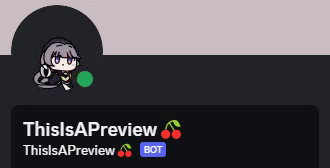

<h1 align="center">Set Animated Avatar For your Bot!</h1>

## 📝 Description

This is a simple application that sends an `PATCH` request to the Discord API to change your bot's avatar to an animated one!

No nitro required! 🎉

## How to use

1. Install latest release from [here](https://github.com/richardscull/animatedavatarfordiscordbots/releases)
2. Use default `avatar.gif` or replace it with your own GIF file (should be named `avatar.gif`)
3. Run ChangeAvatar.exe
4. Enter your bot's token (don't worry, it's not saved anywhere)
5. Done!

#### If you found this useful, consider giving it a star! ⭐